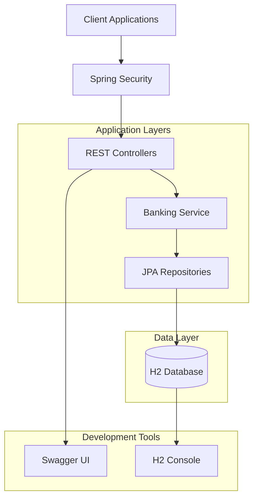

# BankApp - Spring Boot Banking Service

[](LICENSE)

> A RESTful banking application built with Spring Boot that simulates fundamental banking
> operations including customer management, account operations, and financial transactions.

## Table of Contents

- [Overview](#overview)
- [Quickstart](#quickstart)
- [Configuration](#configuration)
- [Usage](#usage)
- [API Documentation](#api-documentation)
- [Architecture](#architecture)
- [Development](#development)
- [Testing](#testing)
- [Troubleshooting](#troubleshooting)
- [Contributing](#contributing)
- [License](#license)

## Overview

BankApp is a comprehensive banking service that provides:

- **Customer Management**: Complete CRUD operations for customer lifecycle
- **Account Operations**: Create accounts, manage balances, and track transactions
- **Fund Transfers**: Internal transfers between customer accounts
- **Transaction History**: Complete audit trail of all banking operations
- **Interactive Documentation**: Swagger UI for API exploration
- **Development Tools**: H2 database console for data inspection

**Target Audience**: Developers learning Spring Boot, system integrators needing banking
APIs for testing, and students studying enterprise Java applications.

## Quickstart

### Prerequisites

- OS: macOS/Linux/Windows
- Runtime: Java 8 or higher
- Tools: Maven 3.6+

### Setup

```bash
git clone https://github.com/COG-GTM/java-migration-8-11.git
cd java-migration-8-11
mvn clean install
mvn spring-boot:run
```

### Verify

```bash
curl -u bankapp:changeit http://localhost:8989/bank-api/customers/all
```

The application will start on port 8989 with context path `/bank-api`.

## Configuration

| Name | Required | Default | Description |
| --- | --- | --- | --- |
| server.port | no | 8989 | Application port |
| server.servlet.context-path | no | /bank-api | Base path for all endpoints |
| spring.security.user.name | no | bankapp | Basic auth username |
| spring.security.user.password | no | changeit | Basic auth password |
| spring.h2.console.enabled | no | true | Enable H2 database console |

Configuration is managed through `src/main/resources/application.yml`.

## Usage

### Customer Operations

**Create a customer with account:**

```bash
curl -X POST -u bankapp:changeit \
  -H "Content-Type: application/json" \
  -d '{
    "customerNumber": 1000,
    "firstName": "John",
    "lastName": "Doe",
    "contactDetails": {
      "emailId": "john@test.com",
      "homePhone": "6150000000"
    },
    "customerAddress": {
      "address1": "123 Main St",
      "city": "Nashville",
      "state": "TN",
      "zip": "37076",
      "country": "USA"
    },
    "status": "Active"
  }' \
  http://localhost:8989/bank-api/customers/add
```

**Get all customers:**

```bash
curl -u bankapp:changeit http://localhost:8989/bank-api/customers/all
```

### Account Operations

**Get account details:**

```bash
curl -u bankapp:changeit http://localhost:8989/bank-api/accounts/{accountNumber}
```

**Transfer funds between accounts:**

```bash
curl -X PUT -u bankapp:changeit \
  -H "Content-Type: application/json" \
  -d '{
    "fromAccountNumber": 5000,
    "toAccountNumber": 5001,
    "transferAmount": 100.00
  }' \
  http://localhost:8989/bank-api/accounts/transfer/{customerNumber}
```

**View transaction history:**

```bash
curl -u bankapp:changeit http://localhost:8989/bank-api/accounts/transactions/{accountNumber}
```

## API Documentation

Interactive API documentation is available via Swagger UI:

```text
http://localhost:8989/bank-api/swagger-ui.html
```

### Core Endpoints

**Customer Management:**

- `GET /customers/all` - List all customers
- `POST /customers/add` - Create customer with account
- `GET /customers/{customerNumber}` - Get customer details
- `PUT /customers/{customerNumber}` - Update customer
- `DELETE /customers/{customerNumber}` - Delete customer and accounts

**Account Operations:**

- `GET /accounts/{accountNumber}` - Get account details
- `POST /accounts/add/{customerNumber}` - Create new account
- `PUT /accounts/transfer/{customerNumber}` - Transfer funds
- `GET /accounts/transactions/{accountNumber}` - Get transaction history

## Architecture



**Key Components:**

- **Controllers**: REST endpoints for customer and account operations
- **Service Layer**: Business logic implementation with transaction management
- **Repository Layer**: Spring Data JPA for database operations
- **Security**: Basic authentication for all endpoints
- **Database**: H2 in-memory database for development and testing

**Data Model:**

- Customer ↔ Account (many-to-many via CustomerAccountXRef)
- Account → Transaction (one-to-many)
- Customer → Address, Contact (one-to-one)

## Development

**Install dependencies:**

```bash
mvn clean install
```

**Run application:**

```bash
mvn spring-boot:run
```

**Run tests:**

```bash
mvn test
```

**Build JAR:**

```bash
mvn clean package
```

**Development Tools:**

- Swagger UI: <http://localhost:8989/bank-api/swagger-ui.html>
- H2 Console: <http://localhost:8989/bank-api/h2-console/>
  - JDBC URL: `jdbc:h2:mem:testdb`
  - Username: `sa`
  - Password: (leave empty)

**Code Style:**

- Uses Lombok to reduce boilerplate code
- Follows Spring Boot conventions
- RESTful API design patterns

## Testing

The application includes comprehensive test coverage:

```bash
mvn test
```

**Sample Test Data:**

Sample JSON files for testing are available in `src/test/resources/`:

- `AddCustomer_1000.json` - Sample customer data
- `addAccountInformation*.json` - Sample account data

**Manual Testing:**
Use the Swagger UI or curl commands provided in the Usage section.

## Troubleshooting

**Port already in use:**

- Change `server.port` in `application.yml` or use `--server.port=8080`

**Authentication failures:**

- Verify credentials: username=`bankapp`, password=`changeit`
- Check if Spring Security is properly configured

**Database connection issues:**

- H2 runs in-memory, no external setup required
- Access H2 console to verify data: <http://localhost:8989/bank-api/h2-console/>

**Build failures:**

- Ensure Java 8+ is installed: `java -version`
- Verify Maven installation: `mvn -version`
- Clean and rebuild: `mvn clean install`

## Contributing

See [CONTRIBUTING.md](CONTRIBUTING.md) for development setup and contribution guidelines.

## License

This project is licensed under the MIT License - see the [LICENSE](LICENSE) file for details.

Copyright (c) 2019 Shyam Bathina

