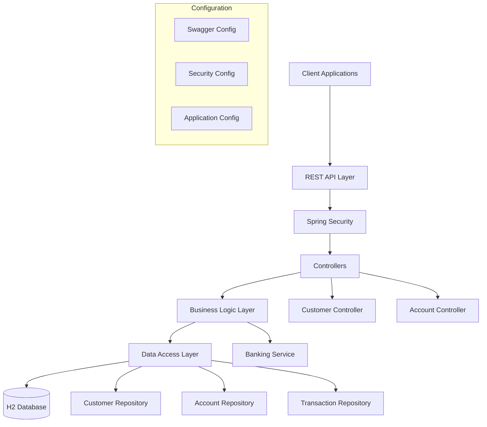

# BankApp - Spring Boot Banking Application

[](LICENSE)

> A RESTful banking application built with Spring Boot that simulates fundamental banking
> operations including customer management, account operations, and financial transactions.

## Table of Contents

- [Overview](#overview)
- [Quickstart](#quickstart)
- [Configuration](#configuration)
- [Usage](#usage)
- [API Endpoints](#api-endpoints)
- [Architecture](#architecture)
- [Development](#development)
- [Testing](#testing)
- [Troubleshooting](#troubleshooting)
- [Contributing](#contributing)
- [License](#license)

## Overview

BankApp is a comprehensive banking simulation application that provides:

- **Customer Management**: Complete CRUD operations for customer lifecycle
- **Account Operations**: Create and manage bank accounts with balance tracking
- **Financial Transactions**: Support for deposits, withdrawals, and internal transfers
- **Transaction History**: Complete audit trail of all financial operations
- **Interactive Documentation**: Swagger UI for API exploration and testing
- **Development-Friendly**: H2 in-memory database with web console access

**Target Audience**: Developers learning Spring Boot, system integrators needing banking APIs
for testing, and students studying enterprise Java application architecture.

## Quickstart

### Prerequisites

- Java 11 or higher
- Maven 3.6+ (or use included Maven wrapper)
- Any modern IDE (Spring Tool Suite, IntelliJ IDEA, Eclipse)

### Setup

```bash
$ git clone https://github.com/COG-GTM/java-migration-8-11.git
$ cd java-migration-8-11
$ mvn clean install
$ mvn spring-boot:run
```

### Verify Installation

```bash
# Check application health (Spring Boot Actuator)
$ curl -u bankapp:changeit -i http://localhost:8989/bank-api/actuator/health

# Access Swagger documentation
$ open http://localhost:8989/bank-api/swagger-ui.html

# Access H2 database console (use JDBC URL: jdbc:h2:mem:testdb)
$ open http://localhost:8989/bank-api/h2-console/
```

## Configuration

| Configuration Property | Required | Default | Description |
|----------------------|----------|---------|-------------|
| server.port | No | 8989 | Application server port |
| server.servlet.context-path | No | /bank-api | Base path for all endpoints |
| spring.security.user.name | No | bankapp | Basic auth username |
| spring.security.user.password | No | changeit | Basic auth password |
| spring.h2.console.enabled | No | true | Enable H2 database console |
| spring.datasource.url | No | jdbc:h2:mem:testdb | H2 database connection URL |

**Configuration Files**:

- `src/main/resources/application.yml` - Main application configuration
- `pom.xml` - Maven dependencies and build configuration

## Usage

### Basic Authentication

All API endpoints require HTTP Basic Authentication:

- **Username**: `bankapp`
- **Password**: `changeit`

### Customer Operations

```bash
# Get all customers
$ curl -u bankapp:changeit http://localhost:8989/bank-api/customers/all

# Add a new customer (creates customer with initial account)
$ curl -u bankapp:changeit -X POST \
  http://localhost:8989/bank-api/customers/add \
  -H "Content-Type: application/json" \
  -d '{
    "firstName": "John",
    "lastName": "Doe",
    "middleName": "H",
    "customerNumber": 1000,
    "status": "Active",
    "contactDetails": {
      "emailId": "john@test.com",
      "homePhone": "6150000000",
      "workPhone": "6151112222"
    },
    "customerAddress": {
      "address1": "123 Domain St",
      "address2": "Suite D",
      "city": "Hermitage",
      "state": "TN",
      "zip": "37076",
      "country": "USA"
    }
  }'

# Get customer by customer number
$ curl -u bankapp:changeit http://localhost:8989/bank-api/customers/1000

# Update customer information
$ curl -u bankapp:changeit -X PUT \
  http://localhost:8989/bank-api/customers/1000 \
  -H "Content-Type: application/json" \
  -d '{"firstName":"John","lastName":"Smith","status":"Active"}'

# Delete customer and all associated accounts
$ curl -u bankapp:changeit -X DELETE \
  http://localhost:8989/bank-api/customers/1000
```

### Account Operations

```bash
# Get account details by account number
$ curl -u bankapp:changeit http://localhost:8989/bank-api/accounts/3000

# Create new account for existing customer
$ curl -u bankapp:changeit -X POST \
  http://localhost:8989/bank-api/accounts/add/1001 \
  -H "Content-Type: application/json" \
  -d '{
    "accountNumber": 3000,
    "accountType": "Checking",
    "accountBalance": 4352,
    "accountStatus": "Active",
    "bankInformation": {
      "branchName": "Schaumburg",
      "branchCode": 1234,
      "routingNumber": 676789345,
      "branchAddress": {
        "address1": "123 McKee Ave",
        "address2": "UNIT 4",
        "city": "Chicago",
        "state": "IL",
        "zip": "60076",
        "country": "USA"
      }
    }
  }'

# Transfer funds between accounts
$ curl -u bankapp:changeit -X PUT \
  http://localhost:8989/bank-api/accounts/transfer/1001 \
  -H "Content-Type: application/json" \
  -d '{
    "fromAccount": 3000,
    "toAccount": 3001,
    "amount": 250.00,
    "transferDescription": "Internal transfer"
  }'

# Get transaction history for an account
$ curl -u bankapp:changeit http://localhost:8989/bank-api/accounts/transactions/3000
```

### Interactive API Documentation

Visit [http://localhost:8989/bank-api/swagger-ui.html](http://localhost:8989/bank-api/swagger-ui.html)
for complete API documentation with interactive testing capabilities.

## API Endpoints

### Customer Management (`/customers`)

- `GET /customers/all` - List all customers
- `POST /customers/add` - Create customer with initial account
- `GET /customers/{customerNumber}` - Get customer details
- `PUT /customers/{customerNumber}` - Update customer information
- `DELETE /customers/{customerNumber}` - Delete customer and associated accounts

### Account & Transaction Management (`/accounts`)

- `GET /accounts/{accountNumber}` - Get account details
- `POST /accounts/add/{customerNumber}` - Create new account for customer
- `PUT /accounts/transfer/{customerNumber}` - Transfer funds between accounts
- `GET /accounts/transactions/{accountNumber}` - Get transaction history

## Architecture



**Key Components**:

- **Controllers**: Handle HTTP requests and responses (`CustomerController`, `AccountController`)
- **Services**: Implement business logic (`BankingService`, `BankingServiceImpl`)
- **Repositories**: Data access using Spring Data JPA
- **Entities**: JPA entities for database mapping (`Customer`, `Account`, `Transaction`)
- **DTOs**: Data transfer objects for API communication

## Development

### Install Dependencies

```bash
$ mvn clean install
```

### Run Application

```bash
$ mvn spring-boot:run
```

### Code Formatting & Linting

```bash
# Compile and check for issues
$ mvn compile

# TODO: Configure Checkstyle plugin in pom.xml for static analysis
# $ mvn checkstyle:check
```

### Run Tests

```bash
$ mvn test
```

### Generate Test Coverage

```bash
# TODO: Configure JaCoCo plugin in pom.xml for coverage reports
$ mvn test
```

### Development Tools

- **Lombok**: Reduces boilerplate code (getters, setters, constructors)
- **Spring Boot DevTools**: Automatic restart during development
- **H2 Console**: Database inspection at `/h2-console/`
- **Swagger UI**: API testing at `/swagger-ui.html`

## Testing

### Unit Tests

```bash
$ mvn test
```

**Integration Testing**
The application includes Spring Boot integration tests that verify:

- REST endpoint functionality
- Database operations
- Security configuration
- Service layer business logic

### Manual Testing

1. Start the application: `mvn spring-boot:run`
2. Access Swagger UI: <http://localhost:8989/bank-api/swagger-ui.html>
3. Use the interactive documentation to test API endpoints
4. Monitor database state via H2 Console: <http://localhost:8989/bank-api/h2-console/>

## Troubleshooting

### Common Issues

| Symptom | Cause | Solution |
|---------|-------|----------|
| Port 8989 already in use | Another app using the port | Change `server.port` or kill process |
| 401 Unauthorized | Missing or incorrect credentials | Use `bankapp:changeit` for basic auth |
| H2 Console not accessible | Security configuration issue | Set `spring.h2.console.enabled=true` |
| Maven build fails | Missing Java 8 | Install Java 8 and set `JAVA_HOME` |
| Swagger UI not loading | Context path configuration | Access via `/bank-api/swagger-ui.html` |

## Deployment

### Local Development

- Port: `8989/tcp`
- Context Path: `/bank-api`
- Health Check: `/bank-api/actuator/health` (requires basic auth)
- Database: H2 in-memory (data lost on restart)

### Production Deployment

```bash
# TODO: Add Dockerfile for containerized deployment
# TODO: Add docker-compose.yml for multi-service setup
# TODO: Configure external database (PostgreSQL/MySQL) for production

# Build JAR for deployment
$ mvn clean package
$ java -jar target/bank-app-*.jar
```

### Environment-Specific Configuration

- Development: Uses H2 in-memory database
- Production: Configure external database via `spring.datasource.*` properties
- Security: Change default credentials in production environments

### Debug Mode

```bash
$ mvn spring-boot:run -Dspring-boot.run.jvmArguments="-Xdebug -Xrunjdwp:transport=dt_socket,server=y,suspend=n,address=5005"
```

### Logging Configuration

Add to `application.yml`:

```yaml
logging:
  level:
    com.coding.exercise.bankapp: DEBUG
    org.springframework.security: DEBUG
```

## Contributing

See [CONTRIBUTING.md](CONTRIBUTING.md) for development setup and contribution guidelines.

**Quick Start for Contributors**:

1. Fork the repository
2. Create a feature branch: `git checkout -b feature/your-feature`
3. Follow existing code patterns and Spring Boot conventions
4. Add tests for new functionality
5. Ensure all tests pass: `mvn test`
6. Submit a pull request

## License

This project is licensed under the MIT License - see the [LICENSE](LICENSE) file for details.

**SPDX-License-Identifier**: MIT
